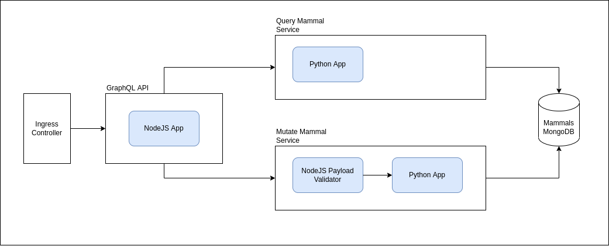

# GraphQL and Kubernetes Example

Very simple project showcasing the basic concepts of a Kubernetes micro service architecture that is set up using Kustomize Kubernetes configuration files found in the [kubernetes](kubernetes/) folder with `dev` and `prod` example environments.

The project has basic CRUD operations for mutating and quering documents containing information of mammals in South Africa. **NOTE** This isn't necessarily the approach I would use for creating an architecture for an application like this (E.g. two services using one db, etc.), it is only an example to illustrate my basic understanding of some fundamental concepts.

This kubernetes set up uses the following base concepts:
 - Pod with one container
 - Pod with multiple containers
 - Deployment
 - Ingress
 - Services
 - Secrets (with .env file and Kustomize)
 - Namespacing (`dev` and `prod`)

A diagram illustrating the project architecture.



## Running the project locally

The docker images are pushed to a local repository set up at `localhost:5000`. You can run a local registry using the docker registry image.

```bash
$ docker run -d -p 5000:5000 --restart=always --name registry registry:2
```

Build the images

```bash
$ ./build.sh
```

Publish the images to `localhost:5000`
```bash
$ ./publish.sh
```

To create the kubernetes locally you will need to use `kind` and `minikube` and deploy the cluster
```bash
# 'dev' can be changed to 'prod'
$ ./deploy.sh dev
```

 - The `dev` graphql API can be accessed at `http://heinvde-staging.mammals/graphql`
 - The `prod` graphql API can be access at `http://heinvde.mammals/graphql`

#### Minikube

To use the ingress controller with minikube you will need to use the add on and then run the deploy script
```bash
$ minikube addons enable ingress
```

To get the IP of minikube for the `dev` environment see the `address` value for `mammals-ingress` from this command
```bash
$ kubectl get ingress -n dev
```

To run the graphql API using through the ingress controller you need to update the hosts file to include the following lines (for linux)
```bash
# /etc/hosts
<ip-of-ingress>    heinvde-staging.mammals
<ip-of-ingress>    heinvde.mammals
```

#### Kind

To run this API with kind locally you have to setup an NGINX ingress according to [this](https://kind.sigs.k8s.io/docs/user/ingress/#ingress-nginx) and then run the deploy script.

To run the graphql API using through the ingress controller you need to update the hosts file to include the following lines (for linux)
```bash
# /etc/hosts
127.0.0.1    heinvde-staging.mammals
127.0.0.1    heinvde.mammals
```

## Services and API

The API and Services can run and be tested separately by referring the each README.

 - [GraphQL API](api/graphql//README.md)
 - [Query Mammal Service](services/mammals/query-mammals/README.md)
 - [Mutate Mammal Service](services/mammals/mutate-mammals/README.md)